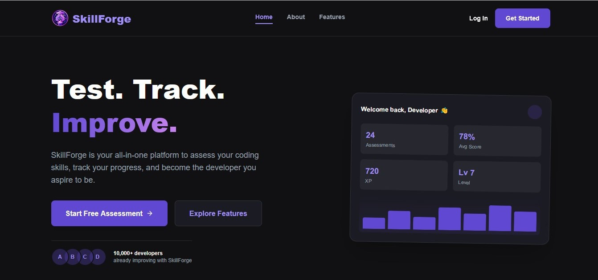
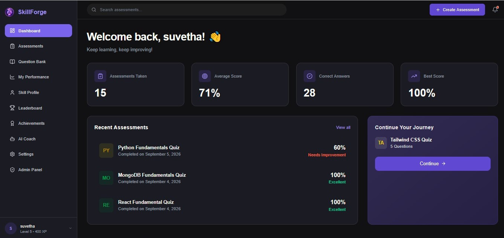
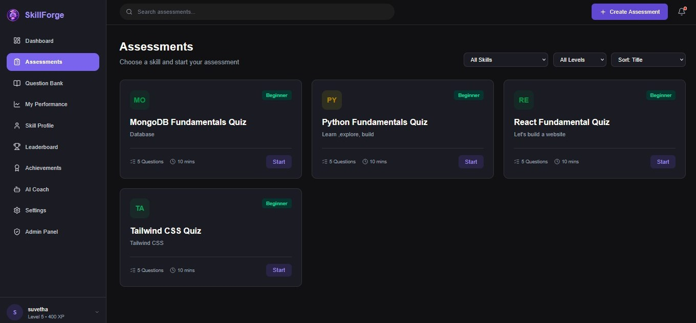
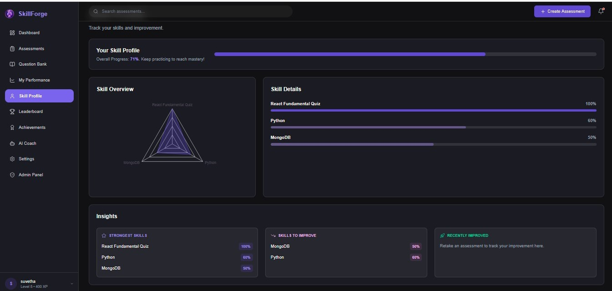

# SkillForge


**A full-stack developer skill assessment platform** — take timed coding assessments, track performance over time, earn XP and achievements, and get AI-powered coaching, all built on the MERN stack.


> Built as a guided, incremental learning project — every feature was implemented and understood step-by-step rather than scaffolded, with a focus on real architectural tradeoffs (security, data integrity, accessibility) over speed.


---


## Table of Contents


- [Screenshots](#screenshots)
- [Features](#features)
- [Tech Stack](#tech-stack)
- [Architecture](#architecture)
- [Project Structure](#project-structure)
- [Getting Started](#getting-started)
- [Environment Variables](#environment-variables)
- [API Overview](#api-overview)
- [Security & Data Integrity](#security--data-integrity)
- [Roadmap](#roadmap)


---


## Screenshots

| Landing Page | Dashboard |
|---|---|
|  |  |


| Taking an Assessment | Skill Profile |
|---|---|
|  |  |


---


## Features


### Authentication & Accounts
- JWT-based auth with bcrypt password hashing
- Email-based password reset (real Gmail SMTP delivery, bcrypt-hashed single-use tokens)
- Role-based access control (user / admin)


### Assessments
- Skill → Question → Assessment data model with full CRUD
- Timed, question-by-question taking experience with a navigation grid, "mark for review," and auto-submit on timeout
- Server-side grading only — correct answers are never exposed to the client before submission
- Full attempt history with per-question review


### Performance & Gamification
- Dashboard with real, computed statistics (no mock data)
- Skill Profile with a radar chart and per-skill progress, built on a MongoDB aggregation pipeline
- XP, levels, and day-based streak tracking
- Rule-based achievement system (assessments completed, perfect scores, streaks, high averages)
- Global leaderboard


### AI Coach
- Integrates Google's Gemini API to generate personalized coaching narratives from real performance data
- On-demand, ungraded AI-generated practice questions per weak skill — deliberately kept separate from the curated, admin-managed Question Bank


### Admin Panel
- Full Create/Read/Update/Delete for Skills, Questions, and Assessments
- User management (promote/demote/delete, with self-protection safeguards)
- Platform-wide statistics dashboard


### Platform Quality
- Full light/dark/system theme support
- Toast notification system and skeleton loading states
- Accessibility pass: skip-to-content link, `focus-visible` indicators, ARIA labels on icon-only controls, live regions for the assessment timer
- Rate limiting on authentication endpoints
- Application-level referential integrity (blocks deletion of Skills/Questions still in use, since MongoDB has no native foreign key constraints)


---


## Tech Stack


**Frontend:** React (Vite), Tailwind CSS v4, React Router, Recharts, Axios, Lucide Icons


**Backend:** Node.js, Express (ESM modules), MongoDB + Mongoose, JWT, bcryptjs


**Integrations:** Google Gemini API (AI coaching), Nodemailer + Gmail SMTP (transactional email), express-rate-limit


**Tooling:** Vite, ESLint, Thunder Client for API testing


---


**Key design decisions:**
- **Server-side grading only** — the client never receives correct answers until after submission, closing a common security gap in assessment platforms
- **Denormalized `skill` field on `Attempt`** — a deliberate tradeoff, trading small data duplication for fast per-skill aggregation queries instead of multi-hop lookups
- **Ephemeral AI content** — Gemini-generated practice questions are never persisted or counted toward gamification, keeping a clear line between curated and AI-generated content


---


## Project Structure

```
SkillForge/
├── client/
│   └── src/
│       ├── api/            # Axios instance with JWT interceptor
│       ├── components/     # Reusable UI (Sidebar, Topbar, Toast, Skeleton...)
│       ├── context/        # Auth, Theme, Toast contexts
│       ├── layouts/        # AppLayout, AdminLayout
│       ├── pages/          # Route-level components
│       └── utils/          # Shared helpers (e.g. skill color mapping)
└── server/
    ├── config/          # DB connection, Gemini client
    ├── controllers/     # Business logic per resource
    ├── middleware/       # auth, admin, rate limiting, error handling
    ├── models/            # Mongoose schemas
    ├── routes/             # Express routers
    ├── seed/                # One-off scripts (achievements, admin promotion)
    └── utils/                 # Gamification logic, email sending
```


---


## Getting Started


### Prerequisites
- Node.js (v18+)
- MongoDB (local install or a free [MongoDB Atlas](https://mongodb.com/cloud/atlas) cluster)
- A [Google Gemini API key](https://aistudio.google.com) (free tier)
- A Gmail account with an [App Password](https://myaccount.google.com/apppasswords) generated


### Installation


```bash
git clone https://github.com/<your-username>/skillforge.git
cd skillforge


# Backend
cd server
npm install


# Frontend
cd ../client
npm install
```


### Environment Setup


Create `server/.env` (see [Environment Variables](#environment-variables) below for the full list).


### Seed reference data


```bash
cd server
node seed/seedAchievements.js
node seed/makeAdmin.js your-email@example.com   # after registering that account once
```


### Run locally


```bash
# Terminal 1
cd server && npm run dev


# Terminal 2
cd client && npm run dev
```


Visit `http://localhost:5173`.


---


## Environment Variables


`server/.env`:


| Variable | Description |
|---|---|
| `PORT` | Backend port (default `5000`) |
| `MONGO_URI` | MongoDB connection string |
| `JWT_SECRET` | Secret for signing JWTs |
| `CLIENT_URL` | Frontend URL, used to build password reset links |
| `GMAIL_USER` | Gmail address for sending transactional email |
| `GMAIL_APP_PASSWORD` | Gmail App Password (not your regular password) |
| `GEMINI_API_KEY` | Google Gemini API key |


---


## API Overview


| Resource | Endpoints |
|---|---|
| Auth | `POST /api/auth/register`, `/login`, `/forgot-password`, `PUT /reset-password/:userId/:token`, `GET /me` |
| Skills | Full CRUD at `/api/skills` (public reads, admin writes) |
| Questions | Full CRUD at `/api/questions` (public reads, admin writes) |
| Assessments | Full CRUD at `/api/assessments`, plus `POST /:id/submit` |
| Attempts | `GET /api/attempts`, `/api/attempts/performance`, `/api/attempts/:id` |
| Achievements | `GET /api/achievements` |
| Users | `GET /api/users/leaderboard` |
| Admin | `/api/admin/stats`, `/api/admin/users`, role/delete management |
| AI Coach | `GET /api/ai-coach/insights`, `POST /api/ai-coach/practice-questions` |


---


## Security & Data Integrity


- Passwords and password-reset tokens both hashed with **bcrypt**
- JWT-based auth with route-level `protect` and `admin` middleware
- Rate limiting on login, registration, and password-reset endpoints (`express-rate-limit`)
- Server-side Mongoose validation (email format, field length/range bounds) — never trusts client-side checks alone
- Application-level referential integrity: deleting a Skill or Question in use is blocked with a clear error, since MongoDB has no native foreign-key enforcement
- Correct assessment answers are stripped from all API responses until after submission


---


## Roadmap


- [ ] Production deployment (Render + MongoDB Atlas — environment is deployment-ready, not yet deployed)
- [ ] Automated test suite (Jest / React Testing Library)
- [ ] Cascading-delete option as an alternative to hard-blocking, with confirmation UI


---


## License


MIT